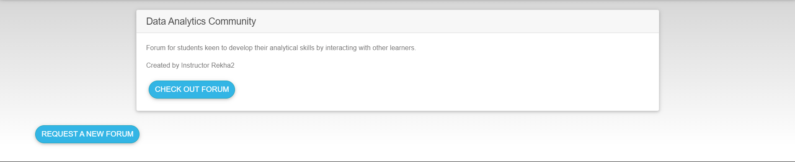
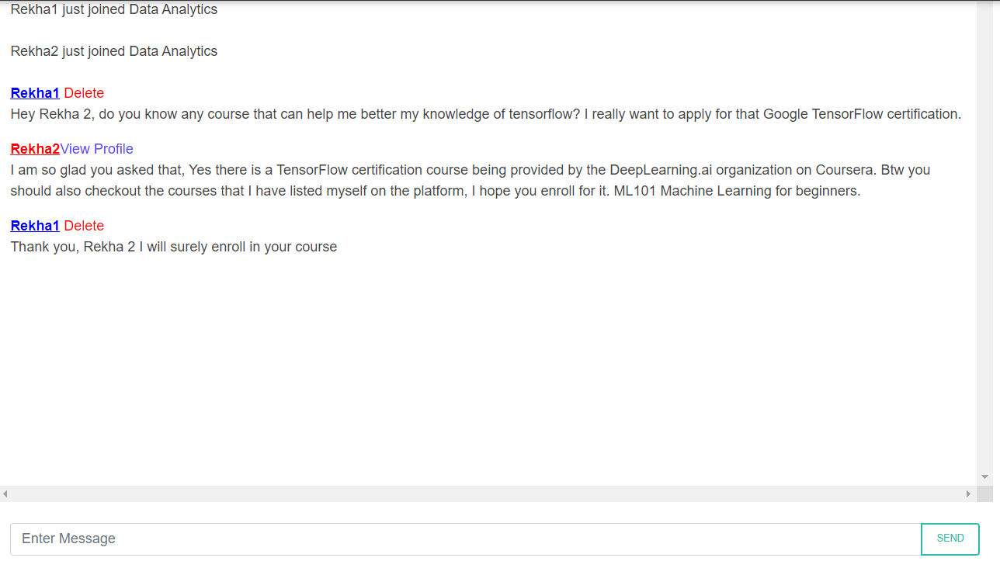
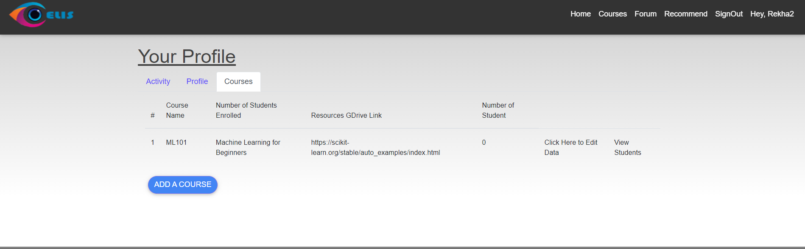
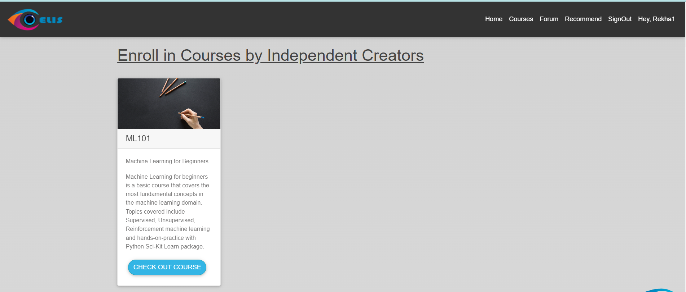

<h1 align="center" > Centralised Information System (CIS)</h1>

<h2>About CIS</h2>

CIS is an educational platform where students can easily browse courses from various other MOOC platforms. We centralize course browsing and on top of that provide a recommendation system that can help you decide what course you want to take up based on your past learning and what you intend to learn. CIS also features a fully fledged Course Enrollment system where Instructors can host their course on our platform and get students enrolled in the system. We also have a discussion forum where students can interact with other students and instructors in real-time. Forums are created based on populor demand by SuperAdmins. For the administration , CIS provides a fully functional administrative dashboard that provides insights into all database activities.

<h2>Features</h2>

* Recommendation System
* Course Hosting and Enrollment System
* Administrative Dashboard
* Real-Time Discussion Forum

<h2>Project is built using:</h2> 
<ul>
  <li>Flask [Micro-WebFramework for Website Backend]</li>
  <li>Flask-Admin [Framework for Admin Dashboard] </li>
  <li>Flask-Mail [Extension for Mailing Support]</li>
  <li>Flask-Login [Authentication Management] </li>
  <li>Flask-Migrate [Extension for Database Schema Management] </li>
  <li>Flask-SQLAlchemy [Extension for Database ORM] </li>
  <li>Flask-SocketIO [Extension for Real-Time Socket Connections]</li>
  <li>GenSim [Recommendation Engine]</li>
  <li>NumPy, Pandas, Pickle [CSV, Model and Serialization ]</li>
  <li>HTML/CSS/JS [Frontend]</li>
</ul>

<h2> Setting Up on Local Machine </h2>

1. Clone the repository using `git clone https://github.com/rekha-kandukuri/CentralisedInformationSystem.git`
2. Navigate to the cloned repository using `cd CentralisedInformationSystem`
3. Setup Python Virtual Environment using either `python -m venv env` or `<path-to-pythonexe -m venv env`
4. Once `env` folder is created run `env\Scripts\Python.exe -m pip install --upgrade pip` to update pip version to latest
5. Now `cd server` and install the dependencies using  `pip install -r requirements.txt`
6. Install `gensim==3.8.3` using `pip install gensim-3.8.3-cp39-cp39-win_amd64.whl`
7. Set an environment variable `set FLASK_APP=cis.py`
8. For DB initialisation use `flask db init` followed by `flask db migrate` followed by `flask db upgrade`
9. After the dependencies have been installed run the server using `python cis.py`
10. The website will be visible at `http://127.0.0.1:5000`.

<h2> Gallery </h2>

<h3></h3>

<h3></h3>

<h3></h3>

<h3></h3>

<h3></h3>

<h3></h3>

